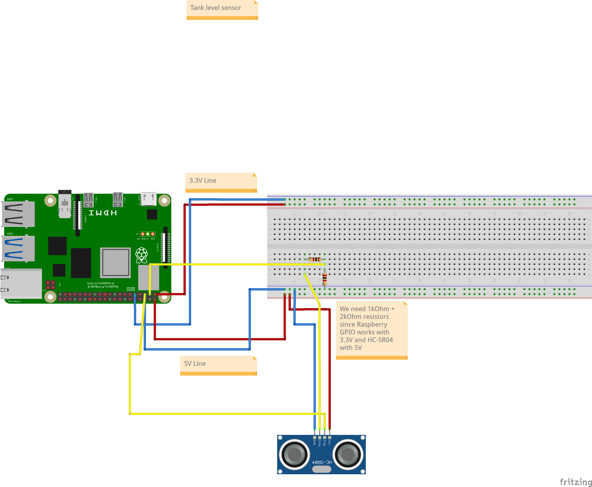
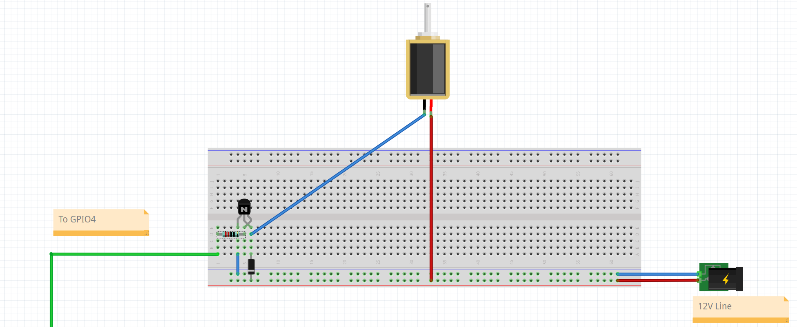

# verderamen

DontLetYourVegetablesDie!

## Deploy on rasbperry

For the deploy on the Raspberry device:

- The Rasberry device port 5000 will be visible online through a service called [Ngrok](https://dashboard.ngrok.com/get-started/setup/raspberrypi)
- There is a small server (`verderamen/server`) that accepts requests on `POST /codebase/webhook :5000`
- On valid requests the servers pulls the content of this repository on the branch `main` (or otherwise the specified one in `VERDERAME_BRANCH`) and restart the systemd service related to this project
- Github is configured to call the server with WebHooks each time some code is pushed

The server also includes telemetries delivery from the application.

## First installation

- Setup your ngrok account and obtain an API token
- Clone repository on your device in `$HOME/verderamen`
- Fix your environment inside `verderamen/.env` (add NGROK_STATIC_DOMAIN, NGROK_APP_TOKEN)
- Run `pipenv run install`

The server should be running as systemd service `verderamen`, this service will sync automatically the just cloned repository and restart itself.

## GPIO Schema

## Overview

### Telemetries server

This application exposes the telemetries at the endpoint `GET /telemetries` with Basic authentication `$$admin` and `SERVER_PASSWORD` (**required**, string) passed on runtime.

### Weather forecast

This application checks weather forecast with [Weather API](https://www.weatherapi.com/api-explorer.aspx#forecast) and assigns a score (from 0 to 1) that will be decisive in determining whether to irrigate or not (0 no water, 1 max time possible). The score is calculated with a weighted mean with some scores derived from temperature, humidity and rain (when under 2mm/24hours). If in the next 24 hours it will rain above 2mm/24hours the weather water score (WWS) will be definitely 1.

The weather will be checked within `WEATHER_CHECK_AT_TIME_RANGE_MINUTES` minutes from `WEATHER_CHECK_AT_TIME` once a day and will keep the forecast data until the next day. In case of errors it will retry till success.

| Description  | Data |
|--------------|------|
| API Example     |  [weather-api.json](/docs/weather-api.json)   |
| Class     |   `/verderamen/services/weather.py`   |

The weather score system is based on this configuration keys:

- `WEATHER_ENABLED` (**optional**, boolean, default: *True*): Enable weather module
- `WEATHER_API_API_KEY` (**required**, string): API Key for Weather API forecast
- `WEATHER_COORDINATES` (**required**, string/lat,lng): Coordinates to use for the weather forecast
- `WEATHER_API_BASE_URL` (**optional**, string/URL, default: *https://api.weatherapi.com/*): base URL for Weather API
- `WEATHER_API_FORECAST_PATH` (**optional**, string/URL-path, default: */v1/forecast.json*): path for Weather API forecast
- `WEATHER_WATER_HIGH_TEMPERATURE` (**optional**, integer/Celsius, default: *40*): high weather that will determine max water score
- `WEATHER_WATER_LOW_TEMPERATURE` (**optional**, integer/Celsis, default: *0*): low weather that will determine low water score
- `WEATHER_WATER_TEMPERATURE_SCORE_WEIGHT` (**optional**, float/[0, 1], default: *0.8*): how much temperature will influence final weather score (0 nothing, 1 all)
- `WEATHER_WATER_HUMIDITY_SCORE_WEIGHT` (**optional**, float/[0, 1], default: *0.3*): how much humidity will influence final weather score (0 nothing, 1 all)
- `WEATHER_WATER_LOW_RAIN_SCORE_WEIGHT` (**optional**, string/[0, 1], default: *1*):  how much low rain (under 2mm of rain in a dat) will influence final weather score (0 nothing, 1 all)
- `WEATHER_CHECK_AT_TIME` (**optional**, string/12:00 AM, default: *12:01 AM*): At what time the weather will be checked (once a day)
- `WEATHER_CHECK_AT_TIME_RANGE_MINUTES` (**optional**, int/minutes, default: *5*): Range before and after `WEATHER_CHECK_AT_TIME` in which the weather will be checked

### Tank level

| Description  | Data |
|--------------|------|
| Sensor model |  HC-SR04    |
| Specs        | https://cdn.sparkfun.com/datasheets/Sensors/Proximity/HCSR04.pdf     |
| Voltage      |   5V   |
| Current     |   12mA   |
| Class     |   `/verderamen/io/tank_level.py`   |

The ECHO PIN is wired to the Rasberry with 1KOhm + 2KOhm resistors since the Raspberry GPIO works at 3.3V while HC-SR04 at 5V.

For the tank level a HC-SR04 ultrasonic sensor is used. For this component these environment variables should be set:

- `TANK_LEVEL_OUT_PIN` (**required**, integer): out pin for sensor
- `TANK_LEVEL_IN_PIN` (**required**, integer): in (echo) pin for sensor
- `TANK_LEVEL_MIN_DISTANCE_CM` (**required**, number): specified minimum distance that will determine 0% level
- `TANK_LEVEL_MAX_DISTANCE_CM` (**required**, number): specified maximum distance that will determine 100% level

### Solenoid valve

| Description  | Data |
|--------------|------|
| Sensor model |  FPD-270A    |
| Specs        | https://www.mantech.co.za/datasheets/products/FPD-270A-102-XXX_SGT.pdf     |
| Voltage      |   12V DC   |
| Power      |   5W   |
| Resistance      |   12v^2 / 5W = 28.8 Ohm   |
| Current     |   417mA   |
| Other     |   Normally closed   |
| Class     |   `/verderamen/io/tank_level.py`   |

The valve is wired to a 12V DC Power supply. The ground is wired to a NPN Transistor Collector (specific model: [PN2222](https://users.ece.utexas.edu/~valvano/Datasheets/PN2222-D.pdf)). The base of the transistor is wired to GPIO PIN set by `VALVE_TRANSISTOR_BASE_OUT_PIN` with a resistor of 220 Ohms (calculated [here](https://guitarscience.net/calcs/ceswtch.htm)). The emitter of the transitor is wired to ground. When the `VALVE_TRANSISTOR_BASE_OUT_PIN` is `HIGH` the valve will open, when `LOW` will be (default) closed.

Configuration:

- `VALVE_TRANSISTOR_BASE_OUT_PIN` (**required**, integer): out pin for transitor BASE
