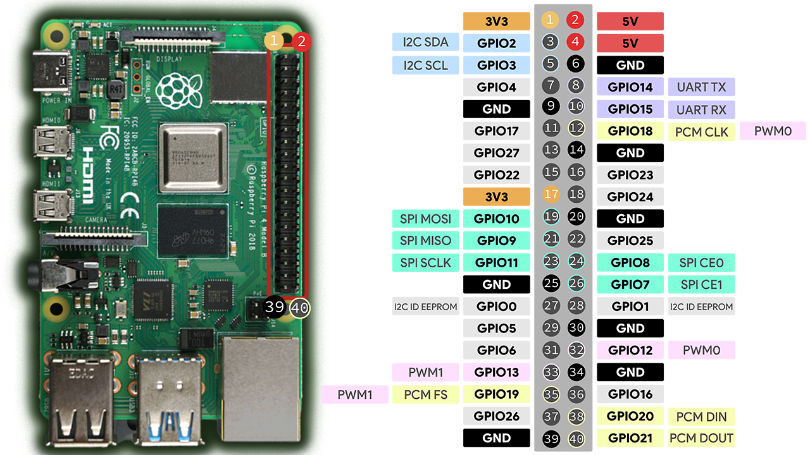

# verderamen

DontLetYourVegetablesDie!

## Deploy on rasbperry

For the deploy on the Raspberry device:

- The Rasberry device port 5000 will be visible online through a service called [Ngrok](https://dashboard.ngrok.com/get-started/setup/raspberrypi)
- There is a small server (`deploy/syncServer.py`) that accepts requests on `POST /webhook :5000`
- On valid requests the servers pulls the content of this repository on the branch `main` (or otherwise the specified one in the args) and restart the systemd service related to this project
- Github is configured to call the small server with WebHooks each time some code is pushed

## First installation

- Setup your ngrok account and obtain an API token
- Clone repository on your device in `$HOME/verderamen`
- Fix your environment inside `verderamen/.env` (add NGROK_STATIC_DOMAIN, NGROK_APP_TOKEN)
- Run `pipenv run install`

The syncServer should be running as systemd service `verderamen-syncer`, this service will sync automatically the just cloned repository and restart the systemd service `verderamen` that is the actual application.

## GPIO Schema

## Configuration

### Tank level configuration

The ECHO PIN is wired to the Rasberry with 1KOhm + 2KOhm resistors since the Raspberry GPIO works at 3.3V while HC-SR04 at 5V.

For the tank level a HC-SR04 ultrasonic sensor is used. For this component these environment variables should be set:

- TANK_LEVEL_OUT_PIN (**required**, integer): out pin for sensor
- TANK_LEVEL_IN_PIN (**required**, integer): in (echo) pin for sensor
- TANK_LEVEL_MIN_DISTANCE_CM (**required**, number): specified minimum distance that will determine 0% level
- TANK_LEVEL_MAX_DISTANCE_CM (**required**, number): specified maximum distance that will determine 100% level